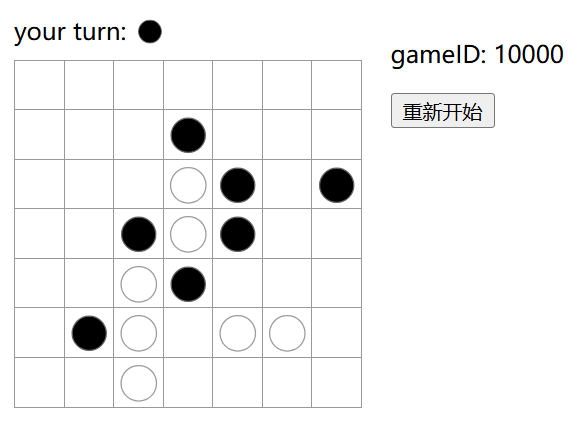

# DRL-五子棋

## 简介
    DRL入门项目，从零实现五子棋交互环境和DRL算法。
    * 使用AI算法实现五子棋AI-Agent 
    
    主要包括：
      * TreeSearch、DRL算法
      * 五子棋Env的优化

  项目代码分三部分
  * 棋局交互UI [web_server](./web_server/)
  * 游戏逻辑 [game.py](./python/dlgobang/game.py)
  * Agent算法、模型 [agent](./python/dlgobang/agent/)、[network](./python/dlgobang/network/)

---

## 1、游戏逻辑

类调用关系：
* GameState (游戏状态)
    * Board （棋盘）
      * grid  （记录落子）
        * LineManager （落子四个方向的连子情况）
      * Lines（当前棋盘上所有连子Line）

连成一条线的棋子使用Line记录, 统一存储在Board.Lines中，用于加速判定五子的数据结构。

对于新落子，首先构造四个方向（横、竖、左对角、右对角）单棋子的Line，后与四周8个棋盘位置、4个方向的候选line做merge。删除Board.Lines中的旧Line，更新merge后的新Line。

Board.grid记录每个落子的情况，用LineManager来存储每个位置映射到底层Line的指针，并可查询当前position棋子的颜色。

GameState在每轮play move后，deepcopy所有对象状态，方便在棋局搜索算法中的状态回退。

---
## 2、算法、模型
- [X] MinMax+Pruning
- [X] 蒙特卡洛搜索树-MCTS
- [ ] DQN
- [ ] AC+PPO
- [ ] AGZ
  - 算力问题 TODO

---
## 3、棋局交互UI - Web Server
使用React+Flask实现AI Agent的部署和对弈可视化。
目前勉强能用，后续优化TODO

3.1 RUN
* Step1: 启动后端Flask-棋局服务
        
        cd ./web_server/back_end/
        flask --app server run
* Step2: 启动前端React
        
        cd ./web_server/front_end/
        npm run start
        注：vscode可直接点击package.json执行

3.2 效果展示 
* MCTS 5K rollout 对局局面
  
